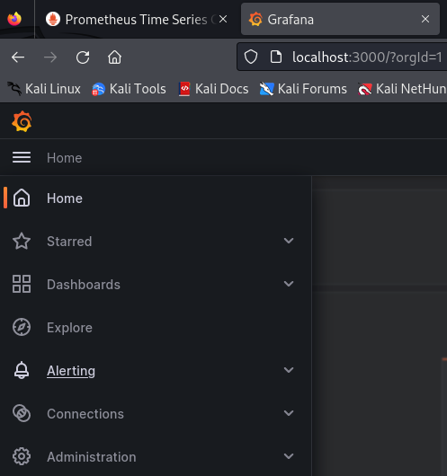
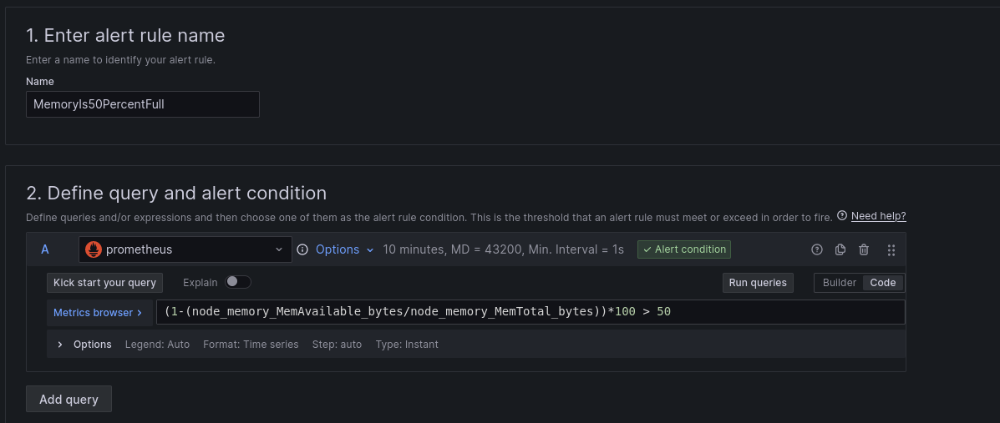
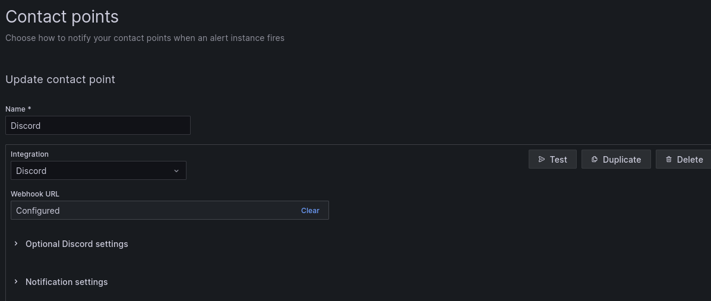
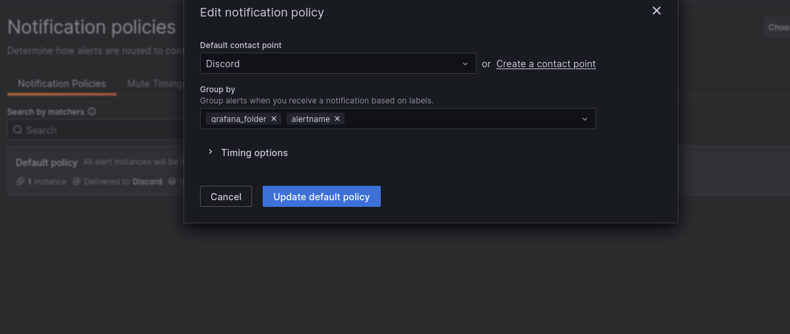

# Prometheus monitoring

<details>

 <summary>Table of Contents</summary>

- [Preparation](#prep)
- [Queries](#query)
- [Grafana](#grafana)
- [Nginx](#nginx)
- [Alerting](#alert)
  - [Prometheus](#prometheus_alert)
  - [Grafana](#grafana_alert)
- [Custom app](#custom)
- [License](#license)

</details>

<a name="prep"></a>

## Preparation
### docker-compose.yml
It can be any name, but best practice is *docker-compose.yml* file
```commandLine
vim docker-compose.yml
```
The content of the file:
```
version: '3.8'

networks:
  monitoring:
    driver: bridge

volumes:
  prometheus_data: {}

services:
  node-exporter:
    image: prom/node-exporter:latest
    container_name: node-exporter
    restart: unless-stopped
    volumes:
      - /proc:/host/proc:ro
      - /sys:/host/sys:ro
      - /:/rootfs:ro
    command:
      - '--path.procfs=/host/proc'
      - '--path.rootfs=/rootfs'
      - '--path.sysfs=/host/sys'
      - '--collector.filesystem.mount-points-exclude=^/(sys|proc|dev|host|etc)($$|/)'
    ports:
      - 9100:9100
    networks:
      - monitoring

  prometheus:
    image: prom/prometheus:latest
    container_name: prometheus
    restart: unless-stopped
    volumes:
      - ./prometheus.yml:/etc/prometheus/prometheus.yml
      - prometheus_data:/prometheus
    command:
      - '--config.file=/etc/prometheus/prometheus.yml'
      - '--storage.tsdb.path=/prometheus'
      - '--web.console.libraries=/etc/prometheus/console_libraries'
      - '--web.console.templates=/etc/prometheus/consoles'
      - '--web.enable-lifecycle'
    ports:
      - 9090:9090
    networks:
      - monitoring
```
It's our initial configuration for docker containers
### prometheus.yml
It's our config file for prometheus that was mentioned in docker-compose.yml
```commandLine
vim prometheus.yml
```
Basic config for Prometheus:
```
scrape_configs:
  - job_name: 'prometheus'
    scrape_interval: 1m
    static_configs:
      - targets: ['localhost:9090']

  - job_name: 'node'
    static_configs:
      - targets: ['node-exporter:9100']
```
### Run with docker
```
docker compose up -d
```
### Check
Depends on the setup
if you use your local machine simple curl to localhost will suffice:
```
curl localhost:9100/metrics
```
<a name="query"></a>

## Queries
Memory:
```
((1-(node_memory_MemAvailable_bytes/node_memory_MemTotal_bytes))*100)
```
CPU:
```
100 - avg(irate(node_cpu_seconds_total{mode="idle"}[5m])) * 100
```
Disk:
```
100 - ((node_filesystem_avail_bytes{mountpoint="/",fstype!="rootfs"} * 100) / node_filesystem_size_bytes{mountpoint="/",fstype!="rootfs"})
```
Load:
```
node_load1 
```
Network:
```
irate(node_network_transmit_bytes_total{device="eth0"}[5m])*8
irate(node_network_receive_bytes_total{device="eth0"}[5m])*8
```
<a name="grafana"></a>

## Adding Grafana
Update docker-compose.yml
Add to the end:
```
grafana:
    image: grafana/grafana:latest
    container_name: grafana
    restart: unless-stopped
    volumes:
      - grafana_data:/var/lib/grafana
    ports:
      - 3000:3000
    networks:
      - monitoring
```
update a volume section so it is like that:
```
volumes:
  prometheus_data: {}
  grafana_data: {}
  ```
> **_NOTE:_**  Indentation matters - it's yml

### Run with docker
```
docker compose up -d
```
### Check
Go to *localhost:3000/login* to see Grafana login page.
Credentials: ***admin/admin***

<a name="nginx"></a>

## Export NGINX metrics
Ensure the nginx is installed
```
sudo apt install nginx
```

### Add settings to create metrics endpoint
file to create: */etc/nginx/conf.d/status.conf*

```
server {
listen 8081;

    server_name _;

    location /metrics {
        stub_status on;
    }
}
```
Don't forget to restart the service:
```
sudo systemctl restart nginx.service
```
Possible output:
```
Active connections: 1
server accepts handled requests
3 3 3
Reading: 0 Writing: 1 Waiting: 0 
```
### Stop prometheus container
We need to update prometheus config, but before
```
sudo docker stop prometheus
```
Update *prometheus.yml* file
```
- job_name: 'nginx exporter'
    scrape_interval: 5s
    static_configs:
      - targets: ['nginx_exporter:9113']
```
###  Add NGINX exporter
Add to the end of the *docker-compose.yml*
```
  nginx_exporter:
    image: nginx/nginx-prometheus-exporter:latest
    container_name: nginx_exporter
    command:
      - '-nginx.scrape-uri=http://{Change for your ip}:8081/metrics'
    ports:
      - 9113:9113
    networks:
      - monitoring
```

Start the stack again
```
docker compose up -d
```
<a name="alert"></a>

## Alerting

<a name="prometheus_alert"></a>

### Prometheus configuration

Update *docker-compose.yml* file:
```
alertmanager:
    image: prom/alertmanager:v0.25.0
    container_name: alertmanager
    ports:
      - 9093:9093
    volumes:
      - ./config.yml:/etc/alertmanager/config.yml
    restart: always
    command:
      - '--config.file=/etc/alertmanager/config.yml'
      - '--storage.path=/alertmanager'
    networks:
      - monitoring
```
<a name="license"></a>

### Alert manager config file
Create *config.yml*:
```
global:
  resolve_timeout: 1m

route:
  receiver: 'discord-notifications'

receivers:
  - name: 'discord-notifications'
    discord_configs:
      - webhook_url: '{Your webhook link}'
```
> **_Note:_** update your webhook_url (for discord)

> **_Note:_** visit [documentation](https://prometheus.io/docs/alerting/latest/configuration/#discord_config) to see options

### alert.rules file for prometheus
Create file *alert.rules*: 
```
groups:
- name: AllInstances
  rules:
    - alert: DiskIs80PercentFull
      expr: 100 - ((node_filesystem_avail_bytes{mountpoint="/",fstype!="rootfs"} * 100) / node_filesystem_size_bytes{mountpoint="/",fstype!="rootfs"}) > 80
      for: 1m
      annotations:
        description: 'Disk is full {{ $value }}'
        summary: Disk is full
    - alert: MemoryIs50PercentFull
      expr: ((1-(node_memory_MemAvailable_bytes/node_memory_MemTotal_bytes))*100) > 50
      for: 5m
      annotations:
        description: 'Memory is full {{ $value }}'
        summary: Memory is full
```
The prometheus section of *docker-compose.yml* file:
> **_Note:_** ./alert.rules:/etc/prometheus/alert.rules

> **_Note:_** visit [prometheus alert documentation](https://prometheus.io/docs/prometheus/latest/configuration/alerting_rules/) for more info

### Update prometheus.yml
Add to the beginning:
```
global:
  scrape_interval:     15s

# Rules and alerts are read from the specified file(s)
rule_files:
  - /etc/prometheus/alert.rules

# alert
alerting:
  alertmanagers:
  - scheme: http
    static_configs:
    - targets:
      - "alertmanager:9093"
```
### Restart prometheus and start up the services
```
docker restart prometheus
docker compose up -d
```
### Test
For testing purposes to load the machine you can use *stress-ng*
```
# Make some alerts
apt install stress-ng
stress-ng --vm-bytes $(awk '/MemAvailable/{printf "%d\n", $2 * 0.9;}' < /proc/meminfo)k --vm-keep -m 1
```
Wait for about a minute and enjoy your alerts

<a name="grafana_alert"></a>
### Grafana alerting
Go to your active grafana instance i.e. http://localhost:3000


From there the process is rather straightforward: *Alert rules -> New alert rule*


Then go to *Contact points -> Add contact point*


The last step is to create a notification policy. For example:


Enjoy your alerts

<a name="custom"></a>

## Application from Dockerfile
### Create app.py with requirements for Dockerfile
See the content in the app.py file
Create requirements.txt file with the content:
```
prometheus_client
```
Create Dockerfile:
```
# Use an appropriate base image for your Python application
FROM python:3.9

# Set the working directory
WORKDIR /app

# Copy your Python application code into the container
COPY app.py /app
COPY requirements.txt /app

# Install the necessary dependencies
RUN pip install -r requirements.txt

# Expose the port that your application listens on
EXPOSE 8010

# Run your Python application
CMD ["python", "app.py"]
```

Update docker-compose file:
```
  custom-app:
    build: .
    container_name: my_app
    ports:
      - 8010:8010
    networks:
      - monitoring
```
Update prometheus config with new target:
```
  - job_name: 'custom-app'
    scrape_interval: 5s
    static_configs:
      - targets: ['custom-app:8010']
```
Restart prometheus and start up the services:
```
docker restart prometheus
docker compose up -d
```
## License
[MIT](https://choosealicense.com/licenses/mit/)